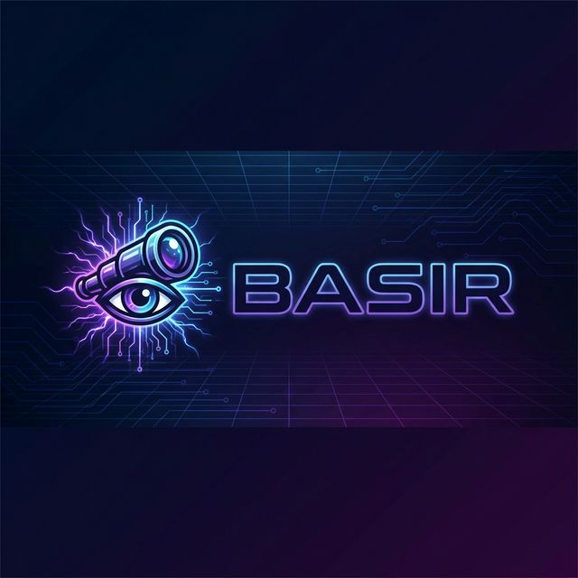
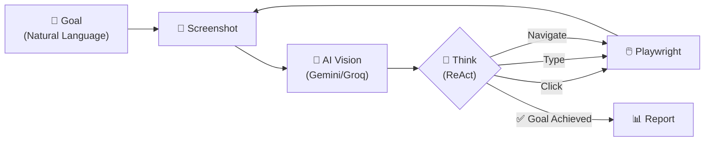

<p align="center">
  
</p>

<h1 align="center">🔭 Basir — Autonomous QA Visionary Agent</h1>

<p align="center">
  <strong>بصير</strong> — AI-powered autonomous QA agent that <em>sees</em>, <em>thinks</em>, and <em>interacts</em> with web UIs like a human tester.
</p>

<p align="center">
  
  
  
  
  
</p>

---

## 🧠 What is Basir?

**Basir** (بصير — Arabic for "The Seer") is an autonomous QA testing agent that eliminates the fragility of traditional CSS/XPath-based test automation. Instead of brittle selectors, Basir uses **multimodal AI vision** to understand web interfaces contextually — just like a human tester would.

### The Problem
Traditional QA automation breaks every time the UI changes — a renamed class, a moved button, a redesigned form. Teams spend more time *maintaining* tests than *writing* them.

### The Solution
Basir **sees the screen**, **reasons about what to do**, and **interacts with elements** using AI-powered coordinate detection. No selectors. No brittle locators. Just a goal in natural language.

---

## ✨ Key Features

| Feature | Description |
|---------|-------------|
| 🧠 **ReAct Pattern** | Autonomous goal-based testing: Observe → Think → Act → Verify |
| 🔄 **Self-Healing** | Automatic recovery from errors — retries with fresh screenshots |
| 👁️ **Vision-First** | Uses Gemini/Groq/DeepSeek/Ollama multimodal models to understand UI |
| 🎯 **Coordinate Navigation** | AI-detected click targets — no CSS selectors needed |
| 📡 **Live Streaming** | Real-time browser feed with CDP Screencast |
| 🖥️ **Streamlit Dashboard** | Beautiful live control room with reasoning logs |
| 🧩 **Command Pattern** | Extensible test architecture — add new test types easily |
| 🏠 **Multi-Provider** | Google AI, Groq, DeepSeek, or fully local with Ollama |

---

## 🏗️ Architecture

```
Basir/
├── main.py                        # CLI entry point
├── app.py                         # 🖥️ Streamlit Live Dashboard
├── requirements.txt               # Dependencies
│
├── basir/                         # Core engine
│   ├── agent.py                   # 🎯 Orchestrator + Self-Healing
│   ├── browser_controller.py      # 🌐 Playwright + CoordinateMapper
│   ├── vision_processor.py        # 👁️ Gemini Vision + Live Streaming
│   ├── groq_processor.py          # ⚡ Groq LLM integration
│   ├── deepseek_processor.py      # 🔮 DeepSeek integration
│   ├── ollama_processor.py        # 🏠 Local Ollama integration
│   ├── reporter.py                # 📊 Test report generation
│   │
│   └── commands/                  # Command Pattern
│       ├── base_command.py        # Abstract base class
│       ├── login_test.py          # Scripted login test
│       └── autonomous_command.py  # 🧠 ReAct autonomous testing
│
├── configs/
│   └── settings.yaml              # Configuration file
│
├── deploy/
│   └── Dockerfile                 # Container deployment
│
└── tests/                         # Unit tests
```

### How It Works



---

## 🚀 Quick Start

### Prerequisites

- **Python 3.10+**
- **API Key** for at least one provider:
  - [Google AI Studio](https://aistudio.google.com/) (Free tier)
  - [Groq](https://console.groq.com/) (Free tier)
  - [DeepSeek](https://platform.deepseek.com/)
  - Or **Ollama** for fully local (no API key needed)

### Installation

```bash
# 1. Clone the repository
git clone https://github.com/MohamedGamal-Ahmed/Basir.git
cd Basir

# 2. Create virtual environment
python -m venv .venv

# Windows
.venv\Scripts\activate

# macOS/Linux
source .venv/bin/activate

# 3. Install dependencies
pip install -r requirements.txt

# 4. Install Playwright browsers
playwright install chromium

# 5. Set up environment variables
cp .env.example .env
# Edit .env with your API keys
```

### Configuration

Create a `.env` file in the project root:

```env
# Choose one or more providers:
GOOGLE_API_KEY=your_google_ai_key
GROQ_API_KEY=your_groq_key
DEEPSEEK_API_KEY=your_deepseek_key

# For Ollama (local), no key needed — just run:
# ollama serve && ollama pull llama3.2-vision
```

Set your preferred provider in `configs/settings.yaml`:

```yaml
api:
  provider: "google_ai"  # Options: google_ai, groq, deepseek, ollama
```

---

## 💻 Usage

### CLI Mode

```bash
# Scripted login test (default)
python main.py --url https://the-internet.herokuapp.com/login

# Autonomous ReAct mode with natural language goal
python main.py --mode autonomous \
  --url https://example.com \
  --goal "Find the contact page and fill out the form" \
  --max-steps 15
```

### Streamlit Dashboard

```bash
streamlit run app.py
```

This launches a real-time dashboard featuring:
- 📡 **Live Browser View** — Watch Basir navigate in real-time
- 🎮 **Control Room** — Set target URL, goal, and mode
- 🧠 **Reasoning Log** — See the AI's thought process step by step
- 📊 **Results Panel** — Test outcomes and screenshots

---

## ⚙️ Supported AI Providers

| Provider | Models | Type | Cost |
|----------|--------|------|------|
| **Google AI Studio** | `gemini-1.5-flash`, `gemini-1.5-pro` | Cloud | Free tier |
| **Groq** | `llama-4-scout`, `llama-3.2-vision` | Cloud | Free tier |
| **DeepSeek** | `deepseek-chat` | Cloud | Paid |
| **Ollama** | `llama3.2-vision` | 🏠 Local | Free |

---

## 🧩 Extending Basir

Add new test types by creating a command class:

```python
from basir.commands.base_command import BaseTestCommand

class MyCustomTest(BaseTestCommand):
    """Custom test command."""

    async def execute(self, agent) -> dict:
        # Your test logic here
        screenshot = await agent.browser.take_screenshot()
        analysis = await agent.vision.analyze_screenshot(screenshot)
        return {"status": "passed", "details": analysis}
```

---

## 📋 Roadmap

| Phase | Description | Status |
|-------|-------------|--------|
| **MVP** | Login flow testing on live URLs | 🔄 In Progress |
| **Phase 2** | Annotated screenshots in bug reports | ⏳ Planned |
| **Phase 3** | Natural language test suite generation | ⏳ Planned |
| **Phase 4** | CI/CD integration & parallel execution | ⏳ Planned |

---

## 🤝 Contributing

Contributions are welcome! Please feel free to submit a Pull Request.

1. Fork the repository
2. Create your feature branch (`git checkout -b feature/AmazingFeature`)
3. Commit your changes (`git commit -m 'Add some AmazingFeature'`)
4. Push to the branch (`git push origin feature/AmazingFeature`)
5. Open a Pull Request

---

## 📄 License

This project is licensed under the MIT License — see the [LICENSE](LICENSE) file for details.

---

## 👤 Author

**Mohamed Gamal**
- GitHub: [@MohamedGamal-Ahmed](https://github.com/MohamedGamal-Ahmed)

---

<p align="center">
  <strong>🔭 Basir sees what selectors can't.</strong>
</p>
