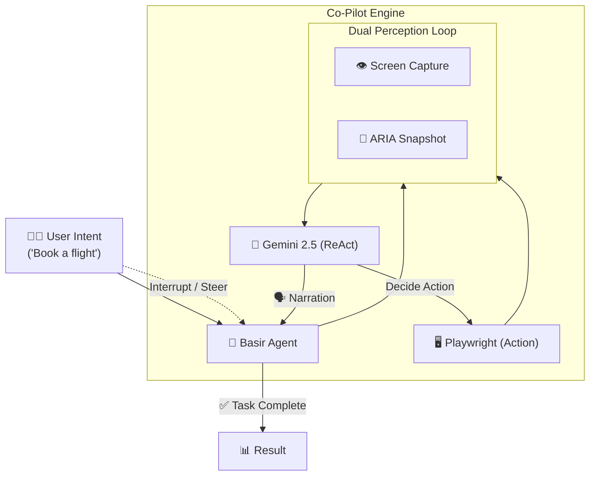

<p align="center">
  
</p>

<h1 align="center">🔭 Basir — Co-Pilot for the Web</h1>

<p align="center">
  <strong>بصير</strong> — An intent-based AI agent that <em>sees</em> the screen, <em>understands</em> your goal, and <em>navigates</em> the web for you.
</p>

<p align="center">
  
  
  
  
  
</p>

---

## 🧠 What is Basir?

**Basir** (بصير — Arabic for "The Seer") is an autonomous AI agent that acts as your personal web navigator. Instead of relying on brittle DOM selectors or predefined scripts, Basir uses **multimodal AI vision and structural perception (ARIA)** to understand web interfaces contextually — just like a human user.

### The Problem
Traditional automation breaks every time the UI changes. Writing scripts to book a flight, scrape data, or fill out complex forms is tedious and fragile.

### The Solution
Basir **sees the screen**, **reasons about your intent**, and **takes action** (clicking, typing, scrolling). It explains its thought process in real-time and pauses to ask for clarification when needed (Human-in-the-Loop). No selectors. No scripts. Just pure intent.

---

## ✨ Key Features

| Feature | Description |
|---------|-------------|
| 🧠 **Intent-Based Navigation** | Give it a goal ("Book a flight to Paris"), and it drives the browser autonomously. |
| 👁️ **Dual Perception** | Fuses Vision (Gemini 2.5) with ARIA snapshots for perfect contextual understanding. |
| 🗣️ **Real-time Narration** | Basir explains its reasoning out loud as it navigates. |
| ✋ **Human-in-the-Loop** | Built-in Interrupts/Redirects allow you to steer the agent mid-task. |
| 📦 **Google ADK Integration** | Packaged as a standard Google Agent Development Kit (ADK) component. |
| 🖥️ **Live Stream Dashboard** | Beautiful control room showing exactly what the agent sees and thinks. |
| ☁️ **Cloud Run Ready** | Fast deployment as a microservice using FastAPI and Docker. |

---

## 🏗️ Architecture

```
Basir/
├── main.py                        # CLI entry point
├── app.py                         # 🖥️ Streamlit Live Dashboard
├── requirements.txt               # Dependencies
│
├── server.py                      # ☁️ FastAPI for Cloud Run
├── basir/                         # Core engine
│   ├── agent.py                   # 🎯 Orchestrator & Execution Loop
│   ├── adk_agent.py               # 📦 Google ADK Wrapper
│   ├── browser_controller.py      # 🌐 Playwright + ARIA tree
│   ├── vision_processor.py        # 👁️ Gemini Vision integration
│   ├── reporter.py                # 📊 Execution report generation
│   │
│   └── commands/                  # Command Pattern
│       ├── base_command.py        # Abstract base class
│       └── autonomous_command.py  # 🧠 IntentCommand (ReAct logic)
│
├── configs/
│   └── settings.yaml              # Configuration file
│
├── deploy/
│   └── Dockerfile                 # Container deployment
│
└── tests/                         # Unit tests
```

### How It Works



---

## 🚀 Quick Start

### Prerequisites

- **Python 3.10+**
- **API Key** from [Google AI Studio](https://aistudio.google.com/) (Free tier)

### Installation

```bash
# 1. Clone the repository
git clone https://github.com/MohamedGamal-Ahmed/Basir.git
cd Basir

# 2. Create virtual environment
python -m venv .venv

# Windows
.venv\Scripts\activate

# macOS/Linux
source .venv/bin/activate

# 3. Install dependencies
pip install -r requirements.txt

# 4. Install Playwright browsers
playwright install chromium

# 5. Set up environment variables
cp .env.example .env
# Edit .env with your API keys
```

### Configuration

Create a `.env` file in the project root:

```env
GOOGLE_API_KEY=your_google_ai_key
```

---

## 💻 Usage

### CLI Mode

```bash
# Scripted login test (default)
python main.py --url https://the-internet.herokuapp.com/login

# Autonomous ReAct mode with natural language goal
python main.py --mode autonomous \
  --url https://example.com \
  --goal "Find the contact page and fill out the form" \
  --max-steps 15
```

### 🚀 Running the System (Dual Architecture)

Basir uses a high-performance decoupled architecture:
1. **Background Engine (FastAPI)**: Handles the AI reasoning, browser automation, and high-FPS live MJPEG video stream without blocking.
2. **Dashboard (Streamlit)**: A lightweight client for real-time monitoring and control.

Open **two** separate terminals:

**Terminal 1 (Start the AI Engine):**
```bash
python -m uvicorn server:app --reload
```

**Terminal 2 (Start the Dashboard):**
```bash
python -m streamlit run app.py
```

This launches the real-time Streamlit dashboard featuring:
- 📡 **Live Browser View** — High-FPS smooth video stream via FastAPI
- 🎮 **Control Room** — Set target URL, goal, and mode
- 🧠 **Reasoning Log** — See the AI's thought process step by step
- 📊 **Results Panel** — Test outcomes and screenshots

---

## ⚙️ AI Provider

| Provider | Models | Type | Cost |
|----------|--------|------|------|
| **Google AI Studio** | `gemini-2.5-flash`, `gemini-2.5-pro` | Cloud | Free tier |

---

## 🧩 Extending Basir

Add new test types by creating a command class:

```python
from basir.commands.base_command import BaseTestCommand

class MyCustomTest(BaseTestCommand):
    """Custom test command."""

    async def execute(self, agent) -> dict:
        # Your test logic here
        screenshot = await agent.browser.take_screenshot()
        analysis = await agent.vision.analyze_screenshot(screenshot)
        return {"status": "passed", "details": analysis}
```

---

## 📋 Roadmap

| Phase | Description | Status |
|-------|-------------|--------|
| **MVP** | Intent-based navigation on live URLs | ✅ Complete |
| **Phase 2** | Live Dashboard with Agent Narration | ✅ Complete |
| **Phase 3** | Human-in-the-Loop Interrupts | ✅ Complete |
| **Phase 4** | Advanced Browser Stealth & State Management | ✅ Complete |
| **Phase 5** | Quota Control & Intelligent Model Routing | ✅ Complete |
| **Phase 6** | FastAPI Backend Migration & Decoupled Architecture | ✅ Complete |
| **Phase 7** | Multi-agent collaboration with Google ADK | ⏳ Planned |

---

## 🤝 Contributing

Contributions are welcome! Please feel free to submit a Pull Request.

1. Fork the repository
2. Create your feature branch (`git checkout -b feature/AmazingFeature`)
3. Commit your changes (`git commit -m 'Add some AmazingFeature'`)
4. Push to the branch (`git push origin feature/AmazingFeature`)
5. Open a Pull Request

---

## 📄 License

This project is licensed under the MIT License — see the [LICENSE](LICENSE) file for details.

---

## 👤 Author

**Mohamed Gamal**
- GitHub: [@MohamedGamal-Ahmed](https://github.com/MohamedGamal-Ahmed)

---

<p align="center">
  <strong>🔭 Basir sees what selectors can't.</strong>
</p>
